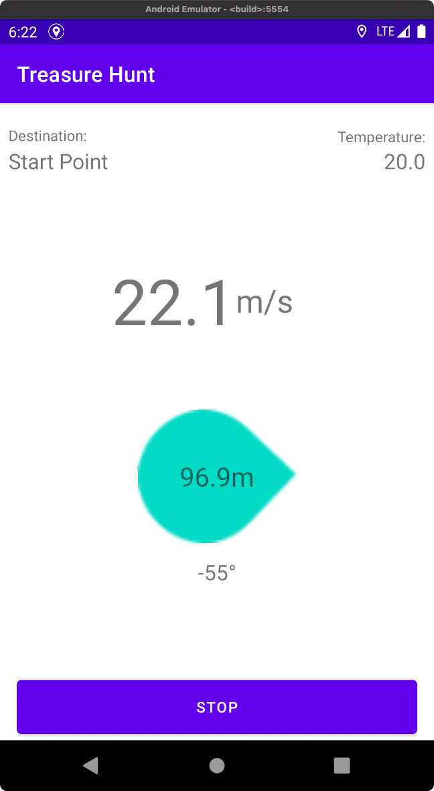

This is an Android app developed in lecture *Mobile_GIS_and_Location-Based_Services* at d'BAUG, ETH Zurich, 2021


## Demo

[Download](https://github.com/markkua/WorkoutTreasureHunt-MobileGIS-LBS/raw/master/apk/TreasureHunt.apk) and install demo apk.


Treasure hunt compass: 



Track review: 


## Setup source code

### Set Azure key

In file `source/TreasureHunt/src/main/res/values/strings.xml`, add your Azure ID, key and domain to:

```xml
<!--  Azure Account Settings  -->
<string name="accountID">YOUR_ACCOUND_ID</string>
<string name="accountKey">YOUR_ACCOUND_KEY</string>
<string name="accountDomain">YOUR_ACCOUNT_DOMAIN</string>
```

### Compile and run

Install dependences (if you use Android Studio, just follow the pop-up instructions). Compile the source code and run in emulator or real machine.


## Preset background

> A new start-up company asks you to develop a location-based fitness app based on Android. The fitness app aims at encouraging the users to get out of their home and do a round trip running or walking near their home.
>
> Latest market research has shown requests for new features, which you are asked to implement: Social sharing option. Track upload.
>
> The start-up company decides to integrate augmented reality (AR) to the android application. The new version of your app should feature an AR component (utilizing Microsoft Spatial Anchor), which allows users to place the collected rewards in the real world, and to locate and re-locate the rewards when they want to do so.


## Functionality

- Treasure hunt compass: select a destination, and show the direction, distance and speed. After finishing, a reward is given, depending on the distance, speed and temperature.

- Track review: review tracks of users in map [Using **ArcGIS SDK**]

- AR: put rewards in AR world an upload to cloud; locate uploaded rewards [using **Microsoft Spatial Anchor**]

  

## Environment

System: macOS with **M1** chip

Emulator: [android-emulator-m1-preview v3](https://github.com/google/android-emulator-m1-preview/releases/tag/0.3) (does not support AR)

Real machine: Google Pixel 3

